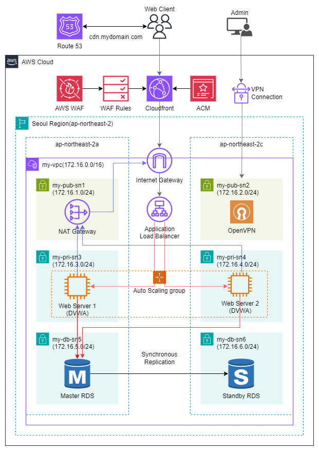

# aws-waf-project
AWS WAF PROJECT

# 주제: AWS WAF와 Cloudfront를 이용한 안정적인 웹 서비스 구현
> [!NOTE]
> **프로젝트 기간:** 2026.04.29 / **난이도:** ★★★☆☆

## 프로젝트 구성도

## 프로젝트 목표:
1. AWS 기본 자원을 생성할 수 있다.
2. AWS Cloudfront를 이용한 CDN 배포 서비스를 구현할 수 있다.
3. AWS WAF로 보안이 강화된 안정적인 웹 서비스를 구현할 수 있다.

## 세부 내용:
1. CloudFormation 스택 배포로 AWS 기본 인프라 구성
2. ALB로 고가용성 구성
3. Auto Scaling Group으로 탄력적 확장 구성
4. OpenVPN 인스턴스로 프라이빗 망 관리
5. AWS WAF로 보안이 강화된 안정적인 웹 서비스 구현
6. CloudFront로 정적 콘텐츠를 빠르게 배포
7. 웹 서버와 DB 서버로 2티어 아키텍처 구현

---
Copyright (C) 2026. NETID
